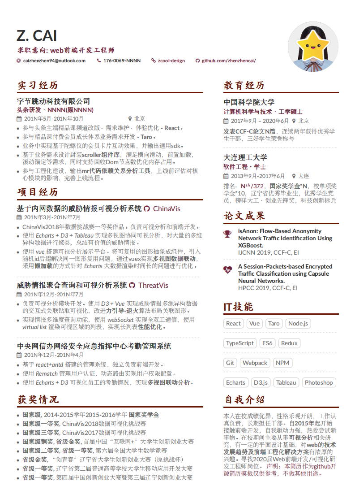

# Fontend-Resume / web前端工程师简历

v1.1.0 (12 Dec 2019), by Zhenzhen Cai (caizhenzhen94@outlook.com)

Download my resume [download](https://github.com/zhenzhencai/Resume-FontEnd/raw/master/fontend-resume-zhenzhencai.pdf)

## Samples

## Requirements and Compilation

* pdflatex + biber + pdflatex
* AltaCV uses [`fontawesome`](http://www.ctan.org/pkg/fontawesome) and [`academicons`](http://www.ctan.org/pkg/academicons); they're included in both TeX Live 2016 and MikTeX 2.9.
* Loading `academicons` is optional: enable it by adding the `academicons` option to `\documentclass`.
* Can now be compiled with pdflatex, XeLaTeX and LuaLaTeX!
* However if you're using `academicons`, you _must_ use either XeLaTeX or LuaLaTeX. If the doc then compiles but the icons don't show up in the output PDF, try compiling with LuaLaTeX instead.
* The samples here use the [Lato](http://www.latofonts.com/lato-free-fonts/) font.
